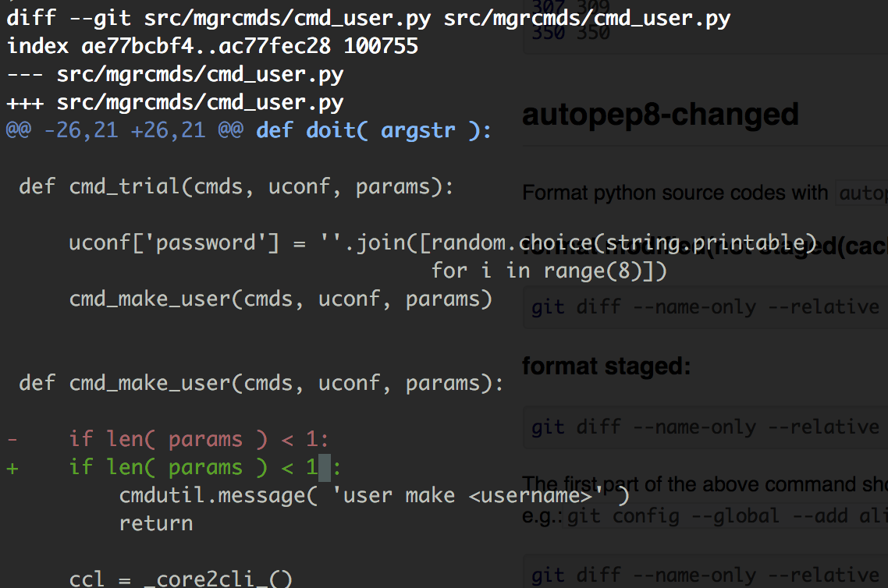
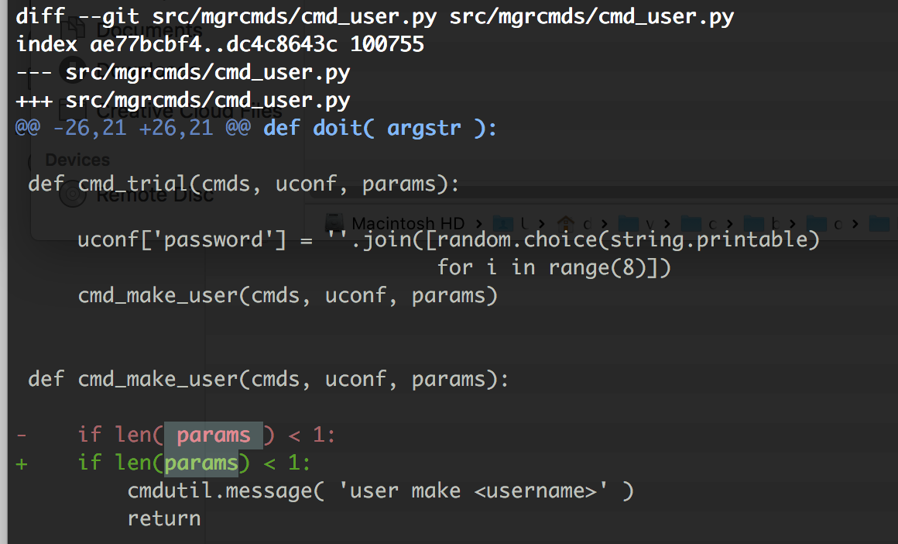

#   Name

Some utility scripts for devops.

#   Status

This library is damn simple and experimental. Risk yourself.

#  Scripts

## git-changed-ln

output changed line number of a file: `<from> <end>`; inclusive:

```
# git-changed-ln x.py
27 28
307 309
350 350
```

## autopep8-changed

Format python source codes with `autopep8` only on changed lines.

Before autopep8, there is a line not well formatted:



Run:

```
git diff --name-only --relative HEAD | autopep8-changed
```

Only the changed lines are formatted by autopep8.
The following lines, although not well formatted, are unaffected.



### format modified(not staged(or cached)) changes

```
git diff --name-only --relative HEAD | autopep8-changed
```

### format staged changes:

```
git diff --name-only --relative HEAD | autopep8-changed --cached
```

The first part of the above command shows all changed file names:

```
git diff --name-only --relative HEAD
```

> I believe you need sth like an `alias` to make life easier,
> e.g.:`git config --global --add alias.chg 'git diff --name-only --relative HEAD'`
>
> Easier life: `git chg | autopep8-changed`.

A helper script `git-changed-ln` is used in `autopep8-changed` that outputs
changed line numbers,
by diff work-tree(unstaged) with HEAD,
or by diff indexed(staged or cached) with HEAD(by passing argument `--cached`
to it).


#   Author

Zhang Yanpo (张炎泼) <drdr.xp@gmail.com>

#   Copyright and License

The MIT License (MIT)

Copyright (c) 2015 Zhang Yanpo (张炎泼) <drdr.xp@gmail.com>
