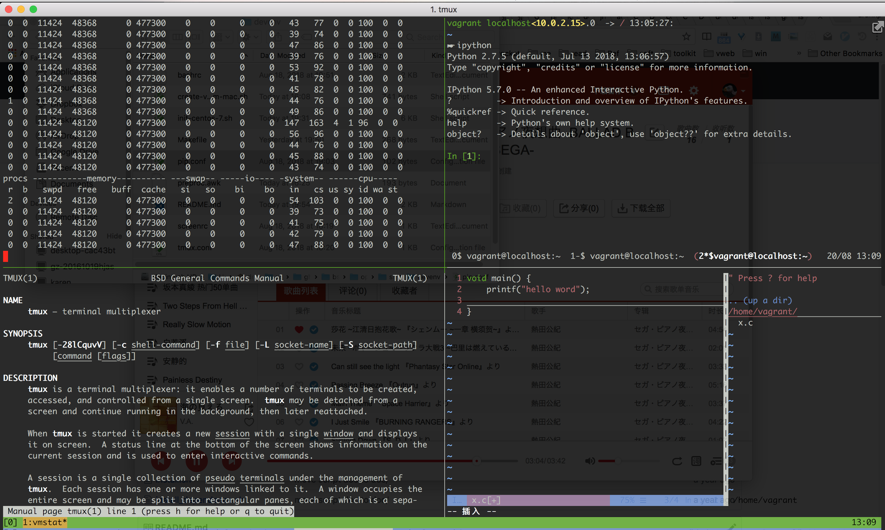

#  Create a vagrant VM on Mac

Create a vagrant VM on Mac as a personal development enviroment in 2 steps.



#   Usage

##  1. Create and start centos-7 VM:

Make a directory for VM(vagrant needs a dir for every VM), e.g.:

```
mkdir ~/va-centos-7
cd ~/va-centos-7
```

Run following script install `vagrant` via `brew`, download centos box if not found,
then create a VM.

```
curl https://raw.githubusercontent.com/bsc-s2/ops/master/bin/create-vagrant-vm-mac.sh | sh
```

## 2. Init a vagrant VM for dev:

Enter VM via ssh:

```
vagrant ssh
```

Run following script inside VM to install packages etc.

```
curl https://raw.githubusercontent.com/bsc-s2/ops/master/bin/init-centos-7.sh | sh
```

**Of course you can use this script to init other non-vagrant VM for
development**.
Using it to init a production server is OK too.


#   What is included in this dev-env

-   languages such as: gcc python2 perl and other libs
-   admin tools such as lsof etc
-   screen and tmux
-   ipython and pip packages such as pyflakes
-   .screenrc, .tmux.conf, .bashrc
-   ssh key
-   basic .vimrc and several vim plugins.


#   Feed back

If you have any trouble using these script, let us know and let us fix it:
[Get help](https://github.com/bsc-s2/ops/issues/new)

#   Contribute

A Makefile builds the above two script: `bin/create-vagrant-vm-mac.sh` and
`bin/init-centos-7.sh`.
Do not edit these files directly.
Instead, modify files in this folder and `make` to re-generate.

-   Packages(yum and pip) to install are defined in `init-centos-7.sh`.

-   Resource file such as `.vimrc` are defined in standalone `vimrc`(without the prefix dot)

    We have a small script `preproc.awk` that replace a place holder such as `source
    vimrc` with the content of file `vimrc`.
